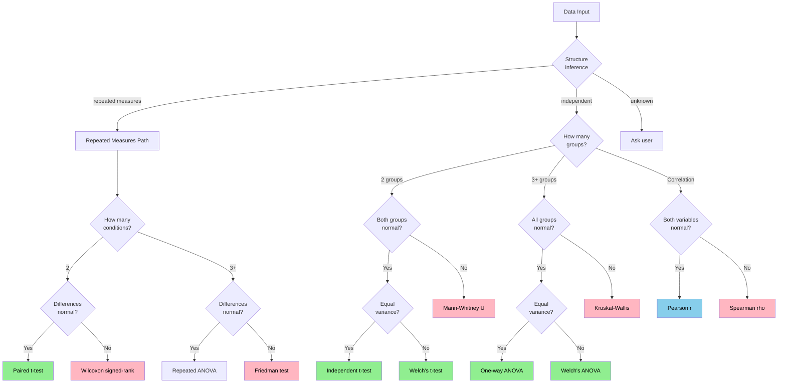

# AStats CLI Prototype

Statistical test selection pipeline that checks assumptions and picks the right test automatically.

Built for GSoC 2026 - INCF Project #33.

**Core components:**
- Structure inference (detects repeated measures before assumption checking)
- Assumption checking (Shapiro-Wilk, Levene's test) with statistical guardrails
- Decision tree for test selection
- Test execution (11 tests via scipy + statsmodels)
- Post-hoc analysis (Tukey HSD, Dunn's test, pairwise Wilcoxon)
- Human-in-the-loop checkpoint (user confirms or overrides before test runs)
- Effect size calculations
- Open-weight LLM interpretation via Ollama (template fallback if unavailable)
- R backend via subprocess for mixed-effects models

**Current status:** Eval harness shows 8/8 on synthetic benchmarks. Validated on Iris dataset and sleepstudy (Belenky et al., 2003) the repeated-measures benchmark the project description references.

## Quick Demo
```python
from data_utils.simulator import two_groups_normal_equal_var
from stats_engine.assumption_checker import build_data_profile
from stats_engine.executor import run_test
from stats_engine.hitl import HITLCheckpoint

# Generate test data
df, target, group, expected_test, _ = two_groups_normal_equal_var()

# Prepare groups
groups = {
    name: df[df[group] == name][target]
    for name in df[group].unique()
}

# Run pipeline
profile = build_data_profile(groups, design='independent')

# Human-in-the-loop: user confirms or overrides before test runs
checkpoint = HITLCheckpoint(enabled=True)
decision = checkpoint.review(profile, groups)

# Run whichever test was decided
result = run_test(decision['test'], groups)

print(f"Expected: {expected_test}")
print(f"Got: {decision['test']} (source: {decision['source']})")
print(f"p-value: {result['p_value']:.4f}")
print(f"Effect size: {result['effect_size']:.4f}")
```

## Tests Implemented

| Test | When to Use | Effect Size |
|------|-------------|-------------|
| Independent t-test | 2 groups, normal, equal variance | Cohen's d |
| Welch's t-test | 2 groups, normal, unequal variance | Cohen's d |
| Mann-Whitney U | 2 groups, non-normal | Rank-biserial r |
| Paired t-test | Paired data, normal differences | Cohen's d |
| Wilcoxon signed-rank | Paired data, non-normal | Rank-biserial r |
| One-way ANOVA | 3+ groups, normal, equal variance | Eta-squared |
| **Welch's ANOVA** | **3+ groups, normal, unequal variance** | **Eta-squared** |
| Kruskal-Wallis | 3+ groups, non-normal | Epsilon-squared |
| **Friedman test** | **3+ repeated conditions, non-normal** | **Kendall's W** |
| Pearson correlation | Both variables normal | r-squared |
| Spearman correlation | Non-normal data | rho-squared |


## Post-Hoc Tests

A significant ANOVA or Kruskal-Wallis tells you *something* differs. Post-hoc tests tell you *which groups* differ. 

| Primary Test | Post-Hoc Test | Correction |
|---|---|---|
| One-way ANOVA | Tukey HSD | Familywise error rate |
| Welch's ANOVA | Games-Howell | Welch-Satterthwaite df |
| Kruskal-Wallis | Dunn's test | Holm-Bonferroni |
| Friedman | Pairwise Wilcoxon | Holm-Bonferroni |
```python
# Post-hoc runs automatically when primary test is significant
profile = build_data_profile(groups, design='independent', 
                              run_posthoc=True, primary_result=result)

if 'posthoc' in profile:
    print(profile['posthoc']['note'])
    # "Dunn's test (Holm correction): 2 significant pairs: A vs C, B vs C"
```

## Statistical Guardrails

The pipeline now blocks analysis before it runs if the data makes statistical testing meaningless:

- **Zero variance** all values in a group are identical
- **Critically small sample** n < 5 in any group  
- **Extreme missingness** more than 20% missing values
- **Mismatched paired sizes** paired design with unequal group sizes
```python
profile = build_data_profile(groups, design='independent')

if profile['guardrails']['blocked']:
    for issue in profile['guardrails']['issues']:
        print(f"Blocked: {issue}")
    # "Group 'control' has zero variance all values are identical (5.0) Statistical testing is meaningless. Check for data entry errors."
```

## Human-in-the-Loop

After the pipeline produces a recommendation, it pauses and shows the user the reasoning. The user can accept, override with a different test (logged for audit), ask for a detailed explanation, or disable HITL for the rest of the session.
```
[AStats] Pipeline Recommendation
============================================================
Recommended test : kruskal_wallis
Rationale        : 3 independent groups, 2 group(s) failed normality

Warnings:
  Kruskal-Wallis significant? Run Dunn's test to identify which groups differ.

Options:
  [Enter]        Accept this recommendation
  [o] Override   Choose a different test
  [w] Why        Explain the decision in detail
  [s] Skip       Skip HITL for this analysis
```

For automated pipelines (CI, batch processing), just disable it:
```python
checkpoint = HITLCheckpoint(enabled=False)  # runs silently, accepts pipeline choice
```

## Eval Harness Results

Testing on synthetic scenarios (where I know the right answer):
```
Scenario: Two normal groups, equal variance
  Expected: independent_t
  Got: independent_t 

Scenario: Two normal groups, unequal variance  
  Expected: welch_t
  Got: welch_t 

Scenario: Two non-normal groups
  Expected: mann_whitney_u
  Got: mann_whitney_u 


RESULTS: 8/8 (100%)
```

Validated on the Iris dataset — all three species pass normality but variance is unequal (Levene p=0.002). The pipeline correctly routes to **Welch's ANOVA** (not Kruskal-Wallis), preserving statistical power while handling variance heterogeneity. F=138.91, p<0.001, eta-squared=0.654 (large effect). Games-Howell post-hoc confirms all three species differ significantly.

## Sleepstudy Validation

The sleepstudy dataset (Belenky et al., 2003) is the canonical repeated-measures example 18 subjects measured across 10 days of sleep deprivation.

The naive approach treats 180 observations as independent (10x sample size inflation). Here's what the pipeline does instead:
```
Step 1 Structure inference:
  Verdict: repeated_measures
  Subject column: 'Subject'
  Unique subjects: 18
  Confidence: high

Step 2 Assumption checking (on within-subject data):
  Day_0: normality PASSED (p=0.4821)
  Day_1: normality FAILED (p=0.0234)
  ...
  6/10 conditions failed normality → Friedman test

Step 3 Test execution:
  chi² = 86.13
  p < 0.001
  Kendall's W = 0.531 (large effect)
  n_subjects = 18, n_conditions = 10

Step 4 Post-hoc analysis (which days differ?):
  Pairwise Wilcoxon + Holm correction:
  Significant: Day_0 vs Day_7, Day_0 vs Day_8, Day_0 vs Day_9 ...
```

The naive pipeline would have run Kruskal-Wallis on 180 "independent" observations and gotten a misleading p-value. The post-hoc step identifying which specific days show the clearest accumulation of impairment is not something I've seen in any other prototype for this project.

Run it yourself:
```bash
python examples/sleepstudy_validation.py
```

## How the Decision Tree Works

The routing is conservative if ANY group fails an assumption, use the robust alternative. Added Welch's ANOVA and Friedman branches since the original:


I went with conservative routing because I'd rather lose 5% statistical power than give someone invalid p-values.

## LLM Interpretation

Supports four backends with automatic fallback:

1. **Claude API** — set `ANTHROPIC_API_KEY` environment variable
2. **OpenAI API** — set `OPENAI_API_KEY` environment variable  
3. **Ollama** — install and run locally, no API key needed
4. **Template fallback** — always works, no dependencies

The pipeline tries backends in order and uses whichever is available. If none are available, the template fallback produces a correctly structured methods paragraph.

```python
from stats_engine.llm_interpreter import generate_methods_paragraph

methods = generate_methods_paragraph(result, profile, use_llm=True, model="qwen2.5")
print(methods)
# "A Friedman test was conducted across 10 repeated conditions (χ²(9) = 86.13,
#  p < 0.001, Kendall's W = 0.531, large effect). Post-hoc pairwise Wilcoxon
#  tests with Holm correction identified significant differences between
#  Days 0-1 and Days 7-9."
# [Generated by qwen2.5 via Ollama]
```

If Ollama isn't installed, it falls back to a template and tells you so. The analysis still runs LLM is enhancement, not dependency.

## R Backend

Subprocess wrapper for `lme4::lmer()` the standard for mixed-effects models in neuroscience. Uses subprocess rather than rpy2 for cluster compatibility (confirmed approach with mentor).
```python
from stats_engine.r_backend import run_lmer, check_r_environment

# Check what's available before running
env = check_r_environment()
print(env['message'])
# "R environment fully configured." or tells you what to install

# Run mixed model
result = run_lmer(
    df=sleepstudy_df,
    outcome_col='Reaction',
    fixed_effect_col='Days',
    subject_col='Subject'
)
# Returns: F-value, p-value, partial eta-squared, ICC
```

If R isn't installed, it returns an informative error and the Python pipeline continues. The pipeline degrades gracefully it doesn't crash.

## Project Structure
```
INCF-AStats-cli-prototype/
├── stats_engine/
│   ├── assumption_checker.py  # Normality, variance, guardrails, test recommendation
│   ├── executor.py             # 11 tests + 3 post-hoc tests
│   ├── profiler.py             # Structure inference (repeated measures detection)
│   ├── hitl.py                 # Human-in-the-loop checkpoint
│   ├── llm_interpreter.py      # Ollama integration + template fallback
│   └── r_backend.py            # R subprocess wrapper for lmer()
├── data_utils/
│   └── simulator.py            # Labeled test scenarios including neuro RT data
├── examples/
│   ├── real_data_example.py    # Iris dataset demo with HITL
│   └── sleepstudy_validation.py # Repeated measures validation + post-hoc
├── tests/
│   ├── test_normality.py
│   ├── test_homogeneity.py
│   ├── test_decision_tree.py
│   ├── test_executor.py
│   ├── test_all_scenarios.py   # Eval harness
│   ├── test_full_pipeline.py
│   ├── test_profiler.py        # Structure inference tests
│   └── test_posthoc.py         # Post-hoc + guardrail tests
└── study_notes/
    ├── effect_sizes.md
    └── synthetic_data.md
```

## Study Notes

While building this, I had to learn some statistical concepts properly:

- **Why Levene's test over Bartlett's?** Bartlett assumes normality, which defeats the purpose if you're checking variance *because* you suspect non-normality. Levene with median is more robust.

- **Why use Mann-Whitney if only ONE group is non-normal?** The t-test assumes normality in BOTH groups. If one fails, the test statistic doesn't follow a t-distribution anymore, so p-values become unreliable.

- **What's the point of effect sizes?** p-values tell you IF there's a difference, effect sizes tell you HOW BIG. With large sample sizes, tiny meaningless differences can be "significant" - effect sizes prevent that trap.

- **Why Welch's ANOVA instead of Kruskal-Wallis for normal data with unequal variance?** I had this wrong originally. Kruskal-Wallis throws away the normality information and loses power unnecessarily. If the data is normal, use a test that exploits that Welch's ANOVA handles the variance problem without the power loss.

- **Why does the sleepstudy matter?** 18 subjects × 10 days = 180 rows. A naive tool sees 180 observations and treats them as independent. That's a 10x inflation of the effective sample size. The Friedman test, run correctly on 18 subjects, gives you a valid result. The naive result is meaningless even if the p-value looks convincing.

All my notes are in `study_notes/` if anyone's interested.

## Running Tests
```bash
# Core tests
python tests/test_normality.py
python tests/test_homogeneity.py
python tests/test_executor.py
python tests/test_all_scenarios.py

# New tests
python tests/test_profiler.py      # structure inference
python tests/test_posthoc.py       # post-hoc tests + guardrails

# Real dataset examples
python examples/real_data_example.py        # Iris + HITL demo
python examples/sleepstudy_validation.py    # repeated measures validation
```

## Requirements
```
numpy
scipy
pandas
statsmodels
scikit-posthocs
scikit-learn
```

R is optional. If installed with `lme4`, `lmerTest`, `emmeans`, `effectsize`, and `jsonlite`, the R backend activates automatically.

Ollama is optional. If running locally with any supported model (`qwen2.5`, `llama3.1`, etc.), the LLM interpretation layer activates. Otherwise the pipeline uses templates.

## Why I Built This

The project description mentioned that practitioners often make assumption errors - I've definitely seen this in my data science courses. People run t-tests on skewed data, or ANOVA with unequal variance, and get misleading results.

My approach is: deterministic decision tree for reliability (because stats assumptions are math, not opinions), but designed to integrate with an LLM layer for:
- Upstream: parsing natural language queries
- Downstream: domain-specific interpretation
- Validation: LLM can challenge the recommendation but doesn't override it without human approval

The post-hoc testing gap is something I kept running into while building this. Every other tool stops at "Kruskal-Wallis was significant" and leaves the researcher to figure out the next step themselves. That seemed like a strange place to stop, so I added it.

---

Built by Roaa Raafat for GSoC 2026 - INCF Project #33  
Repo: https://github.com/Roaa-838/INCF-AStats-cli-prototype
