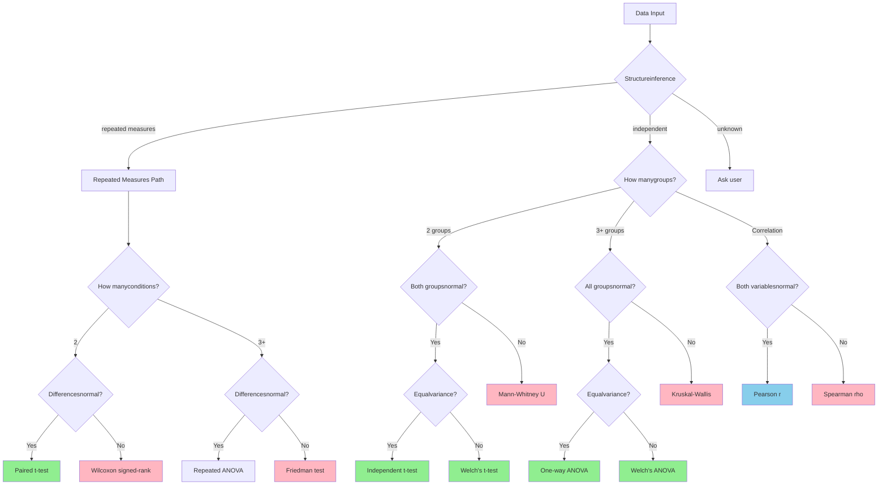

# AStats CLI Prototype

Statistical test selection pipeline that checks assumptions and picks the right test automatically.

Built for GSoC 2026 - INCF Project #33.

**Core components:**
- Structure inference (detects repeated measures before assumption checking)
- Assumption checking (Shapiro-Wilk, Levene's test) with statistical guardrails
- Decision tree for test selection
- Test execution (11 tests via scipy + statsmodels)
- Post-hoc analysis (Tukey HSD, Dunn's test, pairwise Wilcoxon)
- Human-in-the-loop checkpoint (user confirms or overrides before test runs)
- Effect size calculations
- Open-weight LLM interpretation via Ollama (template fallback if unavailable)
- R backend via subprocess for mixed-effects models

**Current status:** Eval harness shows 8/8 on synthetic benchmarks. Validated on Iris dataset and sleepstudy (Belenky et al., 2003) — the repeated-measures benchmark the project description references.


## How the Decision Tree Works

The routing is conservative — if ANY group fails an assumption, use the robust alternative. Added Welch's ANOVA and Friedman branches since the original:


## Quick Demo
```python
from data_utils.simulator import two_groups_normal_equal_var
from stats_engine.assumption_checker import build_data_profile
from stats_engine.executor import run_test
from stats_engine.hitl import HITLCheckpoint

# Generate test data
df, target, group, expected_test, _ = two_groups_normal_equal_var()

# Prepare groups
groups = {
    name: df[df[group] == name][target]
    for name in df[group].unique()
}

# Run pipeline
profile = build_data_profile(groups, design='independent')

# Human-in-the-loop: user confirms or overrides before test runs
checkpoint = HITLCheckpoint(enabled=True)
decision = checkpoint.review(profile, groups)

# Run whichever test was decided
result = run_test(decision['test'], groups)

print(f"Expected: {expected_test}")
print(f"Got: {decision['test']} (source: {decision['source']})")
print(f"p-value: {result['p_value']:.4f}")
print(f"Effect size: {result['effect_size']:.4f}")
```

## Tests Implemented

| Test | When to Use | Effect Size |
|------|-------------|-------------|
| Independent t-test | 2 groups, normal, equal variance | Cohen's d |
| Welch's t-test | 2 groups, normal, unequal variance | Cohen's d |
| Mann-Whitney U | 2 groups, non-normal | Rank-biserial r |
| Paired t-test | Paired data, normal differences | Cohen's d |
| Wilcoxon signed-rank | Paired data, non-normal | Rank-biserial r |
| One-way ANOVA | 3+ groups, normal, equal variance | Eta-squared |
| **Welch's ANOVA** | **3+ groups, normal, unequal variance** | **Eta-squared** |
| Kruskal-Wallis | 3+ groups, non-normal | Epsilon-squared |
| **Friedman test** | **3+ repeated conditions, non-normal** | **Kendall's W** |
| Pearson correlation | Both variables normal | r-squared |
| Spearman correlation | Non-normal data | rho-squared |


## Post-Hoc Tests

A significant ANOVA or Kruskal-Wallis tells you *something* differs. Post-hoc tests tell you *which groups* differ. 

| Primary Test | Post-Hoc Test | Correction |
|---|---|---|
| One-way ANOVA / Welch's ANOVA | Tukey HSD | Familywise error rate |
| Kruskal-Wallis | Dunn's test | Holm-Bonferroni |
| Friedman | Pairwise Wilcoxon | Holm-Bonferroni |

```python
# Post-hoc runs automatically when primary test is significant
profile = build_data_profile(groups, design='independent', 
                              run_posthoc=True, primary_result=result)

if 'posthoc' in profile:
    print(profile['posthoc']['note'])
```

## Statistical Guardrails

The pipeline now blocks analysis before it runs if the data makes statistical testing meaningless:

- **Zero variance** — all values in a group are identical
- **Critically small sample** — n < 5 in any group  
- **Extreme missingness** — more than 20% missing values
- **Mismatched paired sizes** — paired design with unequal group sizes

```python
profile = build_data_profile(groups, design='independent')

if profile['guardrails']['blocked']:
    for issue in profile['guardrails']['issues']:
        print(f"Blocked: {issue}")
```

## Human-in-the-Loop

After the pipeline produces a recommendation, it pauses and shows the user the reasoning. The user can accept, override with a different test (logged for audit), ask for a detailed explanation, or disable HITL for the rest of the session.

## Eval Harness Results

Testing on synthetic scenarios (where I know the right answer):

RESULTS: 8/8 (100%)

## Requirements
```
numpy
scipy
pandas
statsmodels
scikit-posthocs
scikit-learn
```

## Why I Built This

The project description mentioned that practitioners often make assumption errors.

---

Built by Roaa Raafat for GSoC 2026 - INCF Project #33  
Repo: https://github.com/Roaa-838/INCF-AStats-cli-prototype
